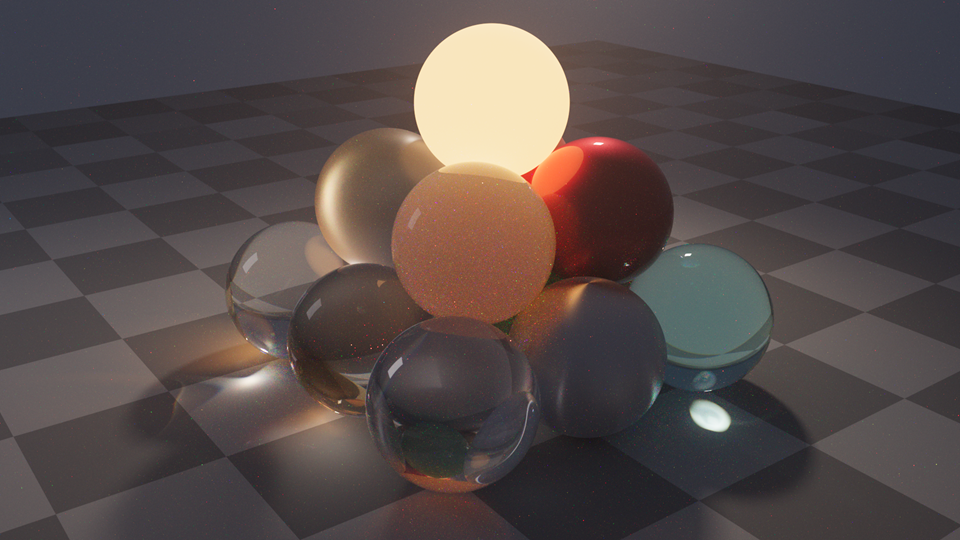

# ar-renderer (PRender)

A physically based, **spectral**, **unbiased** renderer driven by **Metropolis Light Transport**. It is an x64 command-line tool (`prender.exe`) with a lightweight WinUI 3 front end that shows four views of the scene.



## Features

- **Integrators**
  - Multiplexed MLT (default; Hachisuka et al. 2014)
  - Kelemen PSSMLT over full BDPT
  - Bidirectional path tracing
  - A volumetric path tracer used as the reference
  - Unbiased throughout: MLT uses bootstrap resampling and expected-value splatting, termination is by Russian roulette, and there is no clamping, radiance caching or photon merging.
- **Spectral transport** uses hero wavelengths (4 per path). The film accumulates CIE XYZ.
  - In participating media, distances are sampled with the hero wavelength and the path is weighted by **path-level spectral MIS** (Miller et al. 2019) in the path tracer, BDPT and both MLT variants. This keeps per-wavelength weights bounded in coloured media, which removes most of the colour speckle on subsurface materials.
  - **Chromatic dispersion** comes from Sellmeier or Cauchy IOR data (BK7, SF11, diamond, water, fused silica, sapphire).
  - RGB inputs are converted to smooth spectra with Jakob & Hanika 2019.
- **Materials**
  - Lambertian diffuse
  - Rough, anisotropic GGX conductors with spectral n/k (Au, Ag, Cu, Al)
  - Smooth and rough dielectrics, plus thin dielectrics
  - Layered clear-coat materials using stochastic position-free Monte Carlo
  - A Charlie sheen lobe for satin and velvet
  - Self-illumination (blackbody, RGB or spectral emission)
  - Tangent-space normal maps and height-field bump maps
  - Image, checker and procedural fBm noise textures
- **Media and subsurface scattering**
  - Homogeneous, chromatic participating media with Henyey–Greenstein phase functions. Distance sampling uses one-sample spectral MIS.
  - **Heterogeneous media**: NanoVDB (`.nvdb`) and Mitsuba `.vol` grids, plus procedural noise clouds. Distance sampling uses spectral tracking (Kutz et al. 2017) and transmittance uses ratio tracking; both are unbiased.
  - **Subsurface scattering** is a true volumetric random walk inside a dielectric boundary, with no diffusion approximation.
  - A pure `interface` material bounds fog volumes. Enclosing media are detected automatically.
- **Lights**
  - Area lights on any shape, with an optional cos^n lobe for spot-like softboxes
  - Point and spot lights, and **IES** photometric (goniometric) lights with importance sampling
  - Distant lights
  - A constant, HDR or EXR environment with importance sampling
  - **Preetham sun and sky**: a physically attenuated sun disk (Rayleigh and aerosol extinction by air mass) that can be hit and sampled with MIS
  - Light selection: a **light BVH** (Conty & Kulla 2018) for path-tracer next-event estimation, and power-based selection for light subpaths
- **Cameras**
  - Thin lens (f-stop or aperture), pinhole and orthographic
  - A **realistic lens** that ray-traces lens prescriptions (a built-in double-Gauss 50 mm, or pbrt lens files), with exit-pupil sampling, thick-lens focusing and optional per-element dispersion for real chromatic aberration
- **Formats**
  - Native JSON scenes, plus **glTF 2.0** (`.gltf`/`.glb`, including KHR transmission, volume, IOR, dispersion, sheen, clearcoat, emissive strength and punctual lights) and **pbrt-v4** scenes. These can be rendered directly, pulled in with `include`/`import`, or converted with `--convert`.
  - OBJ and PLY meshes; PNG, JPEG, HDR, EXR and PFM textures.
- **Outputs**
  - OpenEXR (float or half, ZIP-compressed), PFM, and PNG/JPEG with ACES or Reinhard tone mapping
  - Up to **16K** (15360×8640). Outputs and checkpoints are streamed row by row, so no full-resolution copies are made; progressive previews are downscaled.
  - Colour spaces: linear sRGB, ACEScg and Rec.2020, with optional white balance
  - **AOVs**: albedo, normal, depth and position
- **Checkpoint and resume**: renders can be interrupted and continued. A resumed render is bit-identical to an uninterrupted one.
- **Optional denoising and firefly clamp** (both biased, both off by default):
  - `--denoise` writes an *extra* `<name>.denoised.<ext>` image using Intel Open Image Denoise. Its albedo and normal guides are followed through glass, so detail seen through glass is preserved. The unbiased image is always written too.
  - `--clamp <Y>` limits each sample's luminance (path tracer, BDPT and GPU).
- **GPU rendering (optional)**: a SYCL path tracer for Intel GPUs (oneAPI), selected with `--device gpu` or from the UI. It matches the CPU path tracer to within noise. On an Arc A770 it is 2–16× faster than all 24 threads of an i9-12900KF (see [GPU rendering](#gpu-rendering)).
- **No third-party libraries to install**: the BVH, EXR writer and RGB-to-spectrum fitting are built in. stb, nlohmann/json, doctest, tinyexr/miniz, cgltf and NanoVDB are vendored.

## Building

You need Visual Studio 2022 or later with the C++ workload and the Windows App SDK / .NET desktop workload, plus the .NET 8 SDK.

```bat
build.cmd            :: renderer (CMake + Ninja, Release) and the WinUI 3 app
build.cmd renderer   :: renderer only  -> build\bin\prender.exe
build.cmd test       :: renderer + unit/integration tests
build.cmd ui         :: WinUI 3 app only (PRender.sln)
build.cmd gpu        :: optional GPU module (Intel oneAPI DPC++) -> build\bin\prender_gpu.dll
```

The first run fits and caches the RGB-to-spectrum table (`prender_rgb2spec_srgb_v1.bin`), which takes about a second.

### GPU module (optional)

GPU rendering needs:

- the [Intel oneAPI Base Toolkit](https://www.intel.com/content/www/us/en/developer/tools/oneapi/base-toolkit.html) 2025.1 or later (for example `winget install Intel.OneAPI.BaseToolkit`);
- an Intel GPU with a current driver.

Build the renderer first, then:

```bat
build.cmd gpu        :: -> build\bin\prender_gpu.dll plus the SYCL / Level Zero runtime DLLs
build.cmd ui         :: rebuild the app so it ships the GPU module next to its copy of prender.exe
```

- **How it's built and loaded:**
  - The module is compiled with Intel's DPC++ compiler (`icx -fsycl`). `prender.exe` stays MSVC-built and loads the module at runtime through a small C ABI (`src/gpu/gpu_api.h`).
  - Without the module, its runtime or a GPU, everything still works on the CPU.
- **Finding oneAPI:** the script looks under `%ProgramFiles(x86)%\Intel\oneAPI` (override with `ONEAPI_ROOT`) and doesn't need `setvars.bat`.
- **Target GPUs:**
  - Kernels are compiled ahead of time for Arc (DG2) with the large register file. For another GPU, set `GPU_AOT_DEVICE` (for example `bmg`).
  - A generic SPIR-V image is also embedded, so other Intel GPUs work after a one-off JIT compile on first use.

### Denoiser (optional)

```bat
build.cmd oidn       :: downloads Intel Open Image Denoise 2.5.1 (CPU device) into build\bin
```

- `prender.exe` loads `OpenImageDenoise.dll` at runtime only when `--denoise` is used. Without it, it warns and writes the unbiased outputs.
- Only OIDN's CPU device is shipped, taking about 2 s at 4K. Its GPU device brings SYCL runtime DLLs whose names clash with the older ones `prender_gpu.dll` uses.
- Run `build.cmd ui` afterwards so the WinUI app ships the denoiser too.

## Command line

```bat
prender scenes\sphere-pyramid\scene.prscene.json
prender scene.prscene.json --integrator mmlt --mutations 1024 --res 1920x1080 --out beauty.exr --out beauty.png
prender scene.prscene.json --add-rig fog --time 5m --preview preview.png
prender scene.prscene.json --integrator path --spp 4096 --out reference.pfm
prender scene.prscene.json --aov albedo=albedo.exr --aov normal=normal.exr
prender scene.prscene.json --res 8k --out big.exr --out big.png          :: presets: 720p 1080p 1440p 4k 8k 16k
prender scene.prscene.json --checkpoint render.prck --time 10m          :: interrupt any time (Ctrl+C) ...
prender scene.prscene.json --resume render.prck --mutations 4096       :: ... and continue later
prender model.glb --out model.png                                     :: glTF / pbrt scenes render directly
prender kitchen.pbrt --convert kitchen.prscene.json                   :: convert to native JSON
prender --list-devices                                                :: CPU and GPUs (add --progress json for JSON)
prender scene.prscene.json --integrator path --device gpu --spp 4096  :: render on the GPU (or gpu:N)
prender scene.prscene.json --integrator path --spp 256 --denoise      :: also writes *.denoised.* (biased)
prender scene.prscene.json --integrator path --spp 256 --clamp 20     :: firefly clamp (biased)
prender --help
```

With `--progress json`, the renderer writes one JSON event per line on stdout. The events are `stage`, `scene`, `progress`, `preview`, `done` and `error`. With `--control stdin`, the renderer accepts `cancel`, then flushes the current estimate and exits with code 3. Ctrl+C does the same. The UI is built on this protocol.

## GPU rendering

`--device gpu` (or `gpu:N`, or `"device": "gpu"` in `render`) runs the **path tracer** on the GPU. It is the same spectral, unbiased algorithm as the CPU path tracer: hero wavelengths, next-event estimation with MIS, and Russian roulette. It runs as a SYCL megakernel over the CPU's BVH.

- **Supported on the GPU:**
  - Materials: diffuse, conductors, dielectrics (rough, thin and dispersive), coated diffuse and coated conductor, sheen, and checker textures.
  - Media: homogeneous media, subsurface scattering and interface volumes.
  - Lights: area, point and constant-environment lights.
  - Cameras: thin-lens and pinhole.
  - All pixel filters, plus checkpoint and resume.
- **Falls back to the CPU, with a warning:**
  - Integrators other than the path tracer.
  - Orthographic and realistic-lens cameras (rendered by the CPU path tracer).
- **Approximated or ignored, with a warning:**
  - Image textures use their average colour.
  - Heterogeneous media, normal/bump maps, spot/IES/distant/sun lights and image environments are ignored.
- **Accuracy:** every material was checked against the CPU path tracer and BDPT. Mean brightness agrees within 0.15%.
- **Speed:** on an Arc A770 against the 24-thread CPU path tracer, about 6–16× for scenes without coats or sheen and 2–3× with them. The coated-material kernel is much heavier, and every path in the scene pays for it. See [`docs/acceleration-investigation.md`](docs/acceleration-investigation.md) for details.
- **Checkpoints:** GPU and CPU checkpoints are not interchangeable. Resuming on the other device is refused.

## The WinUI 3 app

`src\ui\PRenderUI` shows four views (Top, Front, Right and Camera) on the left and a render panel on the right.

- **Top, Front and Right** are schematic orthographic views. Drag to pan, use the wheel to zoom, and double-click to frame the scene. Hovering over an object shows its name.
- **Camera** shows a quick ray-cast preview framed to the film aspect ratio. Drag to orbit, right-drag to pan and use the wheel to dolly. Edited cameras are rendered through a small override scene that includes the original file.
- **Render panel** controls the camera, integrator, resolution, samples, time limit, seed, **max depth** (starts at the scene's value; 0 = the integrator's default), **device**, light rigs and optional AOVs. The device list is the CPU plus any GPU reported by `prender --list-devices`; choosing a GPU locks the integrator to the path tracer. **Denoise** also writes a denoised image, and a *Denoised* toggle switches the result between it and the unbiased render. **Firefly clamp** sets `--clamp`. **Render** launches `prender.exe`, shows the progressive preview live, and saves results under `%LOCALAPPDATA%\PRenderUI\renders\`. **Continue** resumes the last render from its checkpoint with twice the samples.
- **Scene picker** (toolbar) lists the scenes next to the current one: every scene file in the subfolders of the folder above the current scene's folder (for the samples, `scenes\`). The list is rescanned whenever it is opened, so new or regenerated scenes appear without restarting. Opening a scene from elsewhere switches the list to that scene's surroundings.
- **Open scene** accepts `.prscene.json`, `.gltf`, `.glb` and `.pbrt`. Foreign formats are normalized through `prender --convert`, and meshes are shown as bounding-box proxies.

The app finds `prender.exe` next to itself, in a `build\bin` directory above it, or through `%PRENDER_EXE%`.

## Scene format

Scenes are JSON files that may contain comments. See [`schemas/prscene.schema.json`](schemas/prscene.schema.json). The format separates concerns:

| Section | Holds | Notes |
|---|---|---|
| `textures` | Image and procedural data only | Tagged `srgb`, `linear` or `data`. Uplifted by usage (albedo, unbounded or illuminant) |
| `materials` | BSDF parameters | Each parameter is a constant, a spectrum or a `{"texture": id}` reference. `emission` and `sheen` blocks are optional |
| `media` | Participating media | `homogeneous`, `grid` (`.nvdb`/`.vol`) or `noise`; physical σa and σs, or artist-friendly albedo and mean free path |
| `geometry` | Shapes | `sphere`, `rect`, `box`, `disk`, `mesh` (OBJ, PLY or inline arrays), or `gltf` (a primitive of a glTF file) |
| `objects` | Instances | Geometry + material + transform, plus optional interior and exterior media |
| `lights` | Emitters | Usually kept in **light rigs**; models never contain lights |
| `rigs` / `active_rigs` | Swappable lighting | Select with `--rig name` or `--add-rig name` |
| `cameras` | Any number of named cameras | Optics and pose only; film settings live in `render.film` |
| `render` | Integrator, film and outputs | Every value can be overridden from the command line |

`include` merges other files first: dictionary sections merge by id and `objects` are concatenated. `import` does the same for glTF, pbrt or scene files and can place them with a `transform`. The sample scene keeps materials in `materials.json` and each light rig in `rigs/*.json`.

## Sample scenes

### Sphere pyramid

`scenes/sphere-pyramid` is a square pyramid of 14 spheres (3×3 + 2×2 + 1) that exercises the main material and light-transport features:

| Feature | Spheres |
|---|---|
| Dispersion and caustics | SF11 flint, BK7 crown, diamond |
| Absorbing water and rough glass | water, frosted glass |
| Metals | polished gold, rough copper, anisotropic satin aluminium |
| Subsurface scattering | jade, wax, opal glass |
| Clear-coat | car paint |
| Sheen | red satin fabric |
| Self-illumination | a 2700 K emitter at the apex |

The `studio` rig has a gridded key light (cos^6 lobe), a large fill softbox and a cool sky. The `fog` rig adds a haze volume for light shafts. The `daylight` rig replaces both with a Preetham sun and sky. The `lens` camera views the scene through the double-Gauss lens with dispersion.

### Diamonds

`scenes/diamonds` shows six loose, gem-quality diamonds on draped ivory silk: three round brilliants (1.0, 0.5 and 0.3 ct), two princess cuts and a marquise. The stones lie table up, table down and on their sides.

- **Stones:**
  - The round brilliant has all 57 facets in ideal-cut proportions (table 57%, crown 34.5°, pavilion 40.75°). The princess has a two-tier crown and a chevron pavilion. The marquise is the brilliant mapped onto a 2:1 navette outline.
  - The material is dispersive diamond (`"ior": "diamond"`), so the stones show real fire.
- **Silk:** draped and creased, with a satin-weave bump map, rendered as a rough clear coat over an ivory base plus a sheen lobe.
- **Rigs:**
  - `jeweller` (default): a small hard key, two kickers, a dim softbox and a dark surround.
  - `sparkle`: a ring of eight small LED disks, for maximum scintillation.
  - `window`: soft side light.
- **Cameras:** `main`, `closeup` (the 1 ct stone) and `top`.
- **Rendering:** diamonds are the hardest case for any renderer. Their light arrives through chains of refractions and reflections from small lights, and dispersion reduces those paths to single wavelengths.
  - Use **MMLT** (the default) for final images, with a large bootstrap (the scene uses 4 M samples) and thousands of mutations per pixel. At low counts the stones show coloured patches.
  - The GPU path tracer is fine for framing and for the silk, but the stones stay speckled.
  - Denoising smooths the speckle but tints the stones and blurs their facets, so it isn't recommended for this scene.

`scenes/diamonds/generate.py` (Python with numpy, scipy and Pillow) regenerates the meshes, silk, texture, rigs and scene files. Change the cuts, stone placement or silk there rather than in the JSON.

## Tests

`build.cmd test` runs doctest suites that cover:

- The spectral pipeline: D65 normalization, RGB round-trips, Monte Carlo XYZ and Sellmeier data
- BSDF sampling and evaluation consistency, including PDF-integral and energy bounds
- White-furnace scenes for the path tracer, BDPT and MMLT
- A cross-integrator agreement check (path tracer, BDPT, MMLT and PSSMLT) on a glossy and refractive scene
- Heterogeneous media: grid vs. analytic transmittance, a constant grid vs. an equivalent homogeneous medium, and a NanoVDB fog volume
- Lights: IES parsing and sampling, plus integrator agreement for IES, distant and sun/sky lights
- The light BVH: PMF against empirical frequencies, and many-light renders compared with power sampling and BDPT
- Import: glTF extensions, a pbrt scene against its native twin (which checks camera handedness), and an EXR round trip
- Checkpoint and resume: bit-exact equality with uninterrupted path tracer and MMLT renders, and rejection of mismatched checkpoints
- The realistic lens: focusing, image orientation and dispersion
- Normal and bump mapping
- Chromatic subsurface scattering: the path tracer, BDPT, MMLT and PSSMLT agree per colour channel, and the path tracer's noise stays bounded
- The MLT sampler draws first-used primary samples uniformly
- The firefly clamp, denoiser guide buffers through glass, and OIDN denoising (skipped when OIDN is not installed)

## Layout

```
src/core          math, sampling, spectra, colour, RGB->spectrum, film, image I/O, threading, denoising (OIDN loader)
src/geometry      shapes, OBJ/PLY loading, SAH BVH
src/materials     BxDFs (GGX, dielectric, layered, sheen), textures, materials
src/media         homogeneous, voxel-grid, NanoVDB and noise media
src/lights        area/point/spot/IES/distant/environment/sun lights, Preetham sky, light BVH
src/cameras       thin-lens, orthographic and realistic-lens cameras
src/scene         scene container, JSON loader (includes, imports, rigs, auto media), glTF and pbrt importers
src/integrators   path, BDPT, MMLT/PSSMLT; host side of the GPU path tracer (scene export, device list)
src/gpu           prender_gpu.dll: SYCL path-tracing kernel and its C ABI
src/cli           prender.exe
src/ui/PRenderUI  WinUI 3 front end (C#, Win2D)
tests/            doctest unit and integration tests
scenes/           sample scenes
schemas/          JSON Schema for .prscene.json
```

## Known limitations

- MMLT and PSSMLT need a finite `max_depth`, and paths longer than that are not sampled. Use 64 or more for scenes with heavy subsurface scattering. The path tracer and BDPT use Russian roulette.
- Memory at very high resolutions: the film holds 3 doubles per pixel, so 4K needs 0.2 GB, 8K 0.8 GB and 16K about 3 GB. A 16K checkpoint is the same size on disk, and a float EXR is about 1.5 GB (half: about 0.8 GB). The CLI prints the estimate and warns when it approaches the available memory; the UI shows it under the resolution.
- The realistic lens camera works with the path tracer only, because it has no closed-form importance for light tracing.
- The GPU runs only the path tracer, and only on Intel GPUs through oneAPI and Level Zero. Scenes with coats or sheen get a much smaller speed-up (see [GPU rendering](#gpu-rendering)).
- USD import and manifold-exploration mutations are not implemented (see `PLAN.md`).
- Denoising and the firefly clamp are biased, and are only ever extra options. Denoising can shift colours slightly on high-variance materials (measured up to about −15% in blue on subsurface spheres at low sample counts), so the unbiased image is always kept. Denoising runs on the CPU only. The clamp doesn't apply to MLT.
- Dispersive glass still produces coloured fireflies: a dispersive surface reduces the path to its hero wavelength, which spectral MIS can't help with.
- Compressed (ZIP/Blosc) NanoVDB files must be re-saved uncompressed.
- The pbrt importer covers the common subset. Unsupported features (curves, cylinders, displacement, motion blur, measured BSDFs) are skipped with a warning.
- SDS paths lit by *point* lights through *pinhole* cameras have zero probability under any unbiased sampler. Use area lights and thin-lens cameras for caustics seen through glass.

## License

Released under the [MIT License](LICENSE). Copyright (c) 2026 Andrew Rigney.

Vendored third-party code in `third_party/` keeps its own license:

| Library | License |
|---|---|
| [stb_image / stb_image_write](https://github.com/nothings/stb) | MIT or public domain (choose either) |
| [nlohmann/json](https://github.com/nlohmann/json) | MIT |
| [doctest](https://github.com/doctest/doctest) | MIT |
| [tinyexr](https://github.com/syoyo/tinyexr) / miniz | BSD-3-Clause / MIT |
| [cgltf](https://github.com/jkuhlmann/cgltf) | MIT |
| [NanoVDB](https://github.com/AcademySoftwareFoundation/openvdb) (headers) | Apache-2.0 |

Optional runtime components are downloaded by the build rather than vendored: [Intel Open Image Denoise](https://github.com/RenderKit/oidn) (Apache-2.0, `build.cmd oidn`) and the Intel oneAPI SYCL runtime (`build.cmd gpu`).
