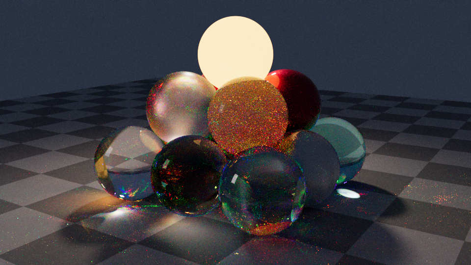

# PRender

A physically based, **spectral**, **unbiased** renderer driven by **Metropolis Light Transport**. It is an x64 command-line tool (`prender.exe`) with a lightweight WinUI 3 front end that shows four views of the scene.



## Features

- **Integrators**
  - Multiplexed MLT (default; Hachisuka et al. 2014)
  - Kelemen PSSMLT over full BDPT
  - Bidirectional path tracing
  - A volumetric path tracer used as the reference
  - Unbiased throughout: MLT uses bootstrap resampling and expected-value splatting, termination is by Russian roulette, and there is no clamping, radiance caching or photon merging.
- **Spectral transport** uses hero wavelengths (4 per path). The film accumulates CIE XYZ.
  - **Chromatic dispersion** comes from Sellmeier or Cauchy IOR data (BK7, SF11, diamond, water, fused silica, sapphire).
  - RGB inputs are converted to smooth spectra with Jakob & Hanika 2019.
- **Materials**
  - Lambertian diffuse
  - Rough, anisotropic GGX conductors with spectral n/k (Au, Ag, Cu, Al)
  - Smooth and rough dielectrics, plus thin dielectrics
  - Layered clear-coat materials using stochastic position-free Monte Carlo
  - A Charlie sheen lobe for satin and velvet
  - Self-illumination (blackbody, RGB or spectral emission)
- **Media and subsurface scattering**
  - Homogeneous, chromatic participating media with Henyey–Greenstein phase functions.
  - Distance sampling uses one-sample spectral MIS.
  - **Subsurface scattering** is a true volumetric random walk inside a dielectric boundary, with no diffusion approximation.
  - A pure `interface` material bounds fog volumes. Enclosing media are detected automatically.
- **Lights**
  - Area lights on any shape, with an optional cos^n lobe for spot-like softboxes
  - Point and spot lights
  - A constant or HDR environment with importance sampling
  - Lights are selected in proportion to their power.
- **Cameras**: thin lens (f-stop or aperture), pinhole and orthographic.
- **Outputs**: OpenEXR (float or half), PFM, and PNG/JPEG with ACES or Reinhard tone mapping. Colour spaces are linear sRGB, ACEScg and Rec.2020, with optional white balance.
- **No third-party libraries to install**: the BVH, EXR writer and RGB-to-spectrum fitting are built in, and stb, nlohmann/json and doctest are vendored.

## Building

You need Visual Studio 2022 or later with the C++ workload and the Windows App SDK / .NET desktop workload, plus the .NET 8 SDK.

```bat
build.cmd            :: renderer (CMake + Ninja, Release) and the WinUI 3 app
build.cmd renderer   :: renderer only  -> build\bin\prender.exe
build.cmd test       :: renderer + unit/integration tests
build.cmd ui         :: WinUI 3 app only (PRender.sln)
```

The first run fits and caches the RGB-to-spectrum table (`prender_rgb2spec_srgb_v1.bin`), which takes about a second.

## Command line

```bat
prender scenes\sphere-pyramid\scene.prscene.json
prender scene.prscene.json --integrator mmlt --mutations 1024 --res 1920x1080 --out beauty.exr --out beauty.png
prender scene.prscene.json --add-rig fog --time 5m --preview preview.png
prender scene.prscene.json --integrator path --spp 4096 --out reference.pfm
prender --help
```

With `--progress json`, the renderer writes one JSON event per line on stdout. The events are `stage`, `scene`, `progress`, `preview`, `done` and `error`. With `--control stdin`, the renderer accepts `cancel`, then flushes the current estimate and exits with code 3. Ctrl+C does the same. The UI is built on this protocol.

## The WinUI 3 app

`src\ui\PRenderUI` shows four views (Top, Front, Right and Camera) on the left and a render panel on the right.

- **Top, Front and Right** are schematic orthographic views. Drag to pan, use the wheel to zoom, and double-click to frame the scene. Hovering over an object shows its name.
- **Camera** shows a quick ray-cast preview framed to the film aspect ratio. Drag to orbit, right-drag to pan and use the wheel to dolly. Edited cameras are rendered through a small override scene that includes the original file.
- **Render panel** controls the camera, integrator, resolution, samples, time limit, seed and light rigs. **Render** launches `prender.exe`, shows the progressive preview live, and saves results under `%LOCALAPPDATA%\PRenderUI\renders\`.

The app finds `prender.exe` next to itself, in a `build\bin` directory above it, or through `%PRENDER_EXE%`.

## Scene format

Scenes are JSON files that may contain comments. See [`schemas/prscene.schema.json`](schemas/prscene.schema.json). The format separates concerns:

| Section | Holds | Notes |
|---|---|---|
| `textures` | Image and procedural data only | Tagged `srgb`, `linear` or `data`. Uplifted by usage (albedo, unbounded or illuminant) |
| `materials` | BSDF parameters | Each parameter is a constant, a spectrum or a `{"texture": id}` reference. `emission` and `sheen` blocks are optional |
| `media` | Participating media | Physical σa and σs, or artist-friendly albedo and mean free path |
| `geometry` | Shapes | `sphere`, `rect`, `box`, `disk`, or `mesh` (OBJ or PLY) |
| `objects` | Instances | Geometry + material + transform, plus optional interior and exterior media |
| `lights` | Emitters | Usually kept in **light rigs**; models never contain lights |
| `rigs` / `active_rigs` | Swappable lighting | Select with `--rig name` or `--add-rig name` |
| `cameras` | Any number of named cameras | Optics and pose only; film settings live in `render.film` |
| `render` | Integrator, film and outputs | Every value can be overridden from the command line |

`include` merges other files first: dictionary sections merge by id and `objects` are concatenated. The sample scene keeps materials in `materials.json` and each light rig in `rigs/*.json`.

## Sample scene

`scenes/sphere-pyramid` is a square pyramid of 14 spheres (3×3 + 2×2 + 1) that exercises the main material and light-transport features:

| Feature | Spheres |
|---|---|
| Dispersion and caustics | SF11 flint, BK7 crown, diamond |
| Absorbing water and rough glass | water, frosted glass |
| Metals | polished gold, rough copper, anisotropic satin aluminium |
| Subsurface scattering | jade, wax, opal glass |
| Clear-coat | car paint |
| Sheen | red satin fabric |
| Self-illumination | a 2700 K emitter at the apex |

The `studio` rig has a gridded key light (cos^6 lobe), a large fill softbox and a cool sky. The `fog` rig adds a haze volume for light shafts.

## Tests

`build.cmd test` runs doctest suites that cover:

- The spectral pipeline: D65 normalization, RGB round-trips, Monte Carlo XYZ and Sellmeier data
- BSDF sampling and evaluation consistency, including PDF-integral and energy bounds
- White-furnace scenes for the path tracer, BDPT and MMLT
- A cross-integrator agreement check (path tracer, BDPT, MMLT and PSSMLT) on a glossy and refractive scene

## Layout

```
src/core          math, sampling, spectra, colour, RGB->spectrum, film, image I/O, threading
src/geometry      shapes, OBJ/PLY loading, SAH BVH
src/materials     BxDFs (GGX, dielectric, layered, sheen), textures, materials
src/media         homogeneous media
src/lights        area/point/spot/environment lights, power-based light sampling
src/cameras       thin-lens and orthographic cameras
src/scene         scene container, JSON loader (includes, rigs, auto media)
src/integrators   path, BDPT, MMLT/PSSMLT
src/cli           prender.exe
src/ui/PRenderUI  WinUI 3 front end (C#, Win2D)
tests/            doctest unit and integration tests
scenes/           sample scenes
schemas/          JSON Schema for .prscene.json
```

## Known limitations

- MMLT and PSSMLT need a finite `max_depth`, and paths longer than that are not sampled. Use 64 or more for scenes with heavy subsurface scattering. The path tracer and BDPT use Russian roulette.
- Only homogeneous media are supported. Heterogeneous (NanoVDB) media, normal and bump mapping, glTF/USD import, and resume/checkpointing are not implemented yet (see `PLAN.md`).
- SDS paths lit by *point* lights through *pinhole* cameras have zero probability under any unbiased sampler. Use area lights and thin-lens cameras for caustics seen through glass.
