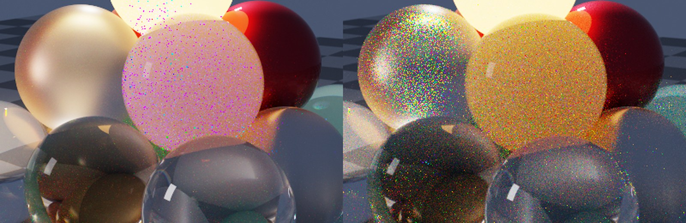
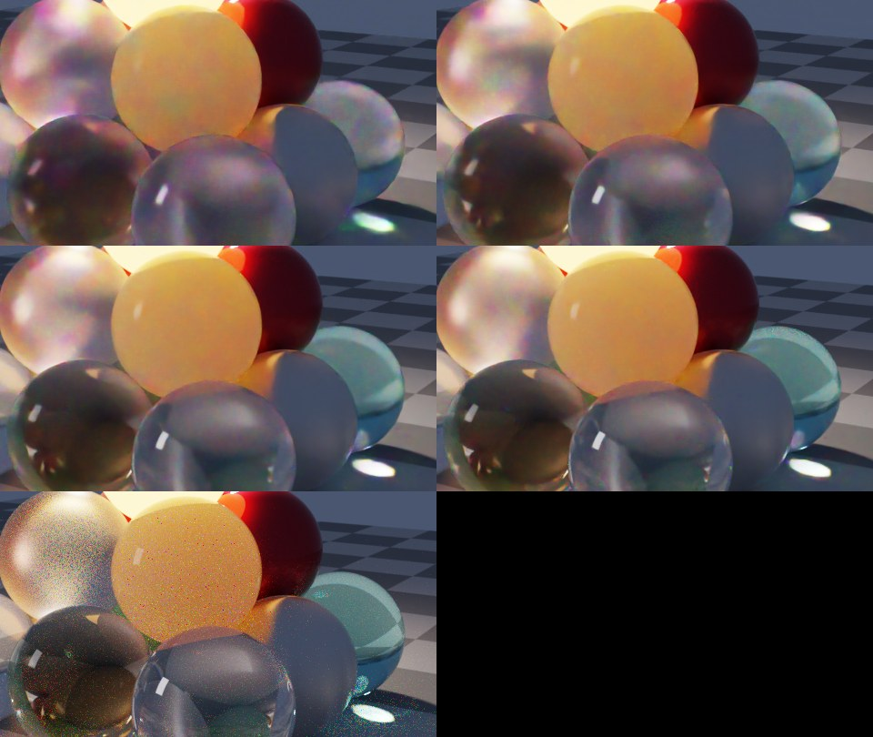

# Denoising investigation

> **Outcome (branch `feature/denoising`):** the causes of the speckle were found and fixed, and optional denoising was added. See §5. §§1–4 are the original investigation. Its first guess, that the rough dielectric boundary triggered the PSSMLT bias, turned out to be wrong.

**Question:** should PRender offer an optional denoiser, accepting that it gives up "unbiased", to deal with speckling?

**Short answer:** yes, as an *extra output* that never replaces the unbiased image. But the investigation found that much of the speckle in the example render is not noise. It is a **bias in the PSSMLT integrator** on coloured subsurface materials, and that needs fixing first. A denoiser run on that image produces a clean image with the wrong colours.

Tools used: [Intel Open Image Denoise (OIDN)](https://github.com/RenderKit/oidn) 2.5.1 (prebuilt Windows binaries, `oidnDenoise`) on an i9-12900KF and an Arc A770.

## 1. What the speckle in the example actually is

The example (`PRenderUI\renders\scene-20260929-190552`) is the sample scene rendered with **PSSMLT** at 3840×2160: 1,912 mutations per pixel, max depth 1024, 1024 chains. Its speckle is single-pixel magenta and green dots, densest on the wax and opal spheres and in the glass.

Measured on a 300×300 patch of the wax sphere:

| Measure | Value |
|---|---|
| Pixels with strongly wrong colour (chromaticity differs from the local median by > 0.3) | **18%** |
| Brightness of those pixels relative to their neighbours | normal (median 1.1×) |
| Bright fireflies (luminance > 3× the local median) | 0.46% |
| Pixels outside the sRGB gamut (a negative channel) | 2.1% |

So it is **colour noise at normal brightness**, not fireflies.

### PSSMLT is biased on the wax sphere

The mean colour of the wax sphere differs between integrators far beyond noise. Ratios below are against the GPU path tracer at 1,024 spp. Sky and floor are included as controls.

| Region, R/G/B ratio | CPU path tracer | BDPT | PSSMLT (fresh, 512 mpp) | PSSMLT (the example, 4K) | MMLT (fresh, 512 mpp) |
|---|---|---|---|---|---|
| Wax sphere | 1.02 / 0.98 / 1.08 | 0.98 / 1.15 / 1.04 | 0.96 / 0.97 / **2.70** | 0.96 / 1.01 / **4.73** | 0.98 / 1.12 / 1.00 |
| Opal sphere | 0.97 / 0.97 / 0.96 | 1.00 / 1.00 / 1.02 | 0.92 / 0.95 / 0.91 | 0.94 / 0.95 / 0.94 | **0.70 / 0.71 / 0.69** |
| Sky | 1.00 / 1.00 / 1.00 | 1.00 / 1.00 / 1.00 | 0.98 / 0.98 / 0.98 | 0.95 / 0.95 / 0.95 | 1.00 / 1.00 / 1.00 |

- **The wax sphere comes out pink in PSSMLT, and amber in the path tracer and BDPT.** Two independent integrators (the path tracers and BDPT) agree, and PSSMLT reproduces the excess blue in a fresh render, so this is a PSSMLT bug, not noise. The wax is a *rough* dielectric boundary (roughness 0.3) around a strongly chromatic scattering interior. The opal and jade spheres use smooth or less rough boundaries and are not affected the same way. The README image also shows the pink wax.
- MMLT renders the wax correctly, but was 30% dark on the opal sphere in one short run. That region is small and MLT noise is spatially correlated, so this needs confirming before calling it a second bug.
- The uniform 2–5% offset on the sky in the MLT renders is the random error of MLT's single normalisation estimate (the bootstrap). It is unbiased on average but visible in any one render.

**Consequence:** OIDN run on the example image (CPU, with and without albedo and normal) leaves the magenta dots almost untouched. It treats them as texture, and in part they *are* signal: wrong signal. Denoising cannot fix this image.

## 2. Why this scene speckles even when it's correct

The scene is genuinely hard for any unbiased spectral method:

- **Spectral transport.** Each path carries 4 hero wavelengths. Dispersive glass (SF11, BK7, diamond) terminates three of them, so the surviving wavelength carries a saturated, often out-of-gamut colour. Along long subsurface random walks, the per-wavelength throughputs diverge (wax albedo 0.96 / 0.86 / 0.70 per channel), and one wavelength dominates.
- **Result:** heavy-tailed *colour* noise. The GPU path tracer at 16,384 spp (7 minutes at 960×540) still shows speckle on the wax, the opal and the dispersive glass.

## 3. OIDN trial

### Speed and memory (4K, "high" quality, colour + albedo + normal)

| Device | Time | Memory |
|---|---|---|
| CPU (24 threads, AVX2) | 2.1 s | 2.4 GB |
| Arc A770 (SYCL, XMX) | **41 ms** (1.7 s on first use) | 0.8 GB |

At 16K, the CPU would take roughly 35 s and about 8 GB unless tiled. OIDN tiles internally when `maxMemoryMB` is set.

### Quality against a reference (GPU path tracer, 960×540, reference = 16,384 spp)

| Input | relMSE, noisy | relMSE, denoised | Wax colour after denoising (R/G/B vs reference) | Caustic colour after denoising |
|---|---|---|---|---|
| 16 spp (0.6 s) | 18.4 | 0.025 | 0.80 / 0.96 / 0.88 | 0.92 / 0.85 / 0.70 |
| 64 spp (1.8 s) | 6.0 | 0.022 | 0.88 / 1.01 / 0.85 | 0.97 / 0.88 / 0.96 |
| 256 spp (6.7 s) | 1.8 | 0.020 | 0.94 / 1.03 / 0.86 | 1.02 / 1.00 / 0.94 |
| 1024 spp (26 s) | 0.36 | 0.018 | 0.96 / 1.02 / 0.83 | 1.01 / 1.03 / 0.98 |

- **The error collapses by 20–1000×.** A 64-spp denoised image (2 s of GPU time) has lower relMSE than the 1,024-spp noisy image. It also looks cleaner than the 16,384-spp reference.
- **But denoising has a bias floor.** The denoised error barely improves with more samples (0.025 → 0.018), and colours shift systematically. The wax sphere loses 14–17% of its blue at every sample count, and caustics lose up to 30% of their blue at low counts. The rare, bright, coloured samples that carry that energy look like noise to the network and get removed. This is exactly the bias the user accepted in the question, and it is *measurable*: the renderer should say so and keep the raw image.
- **Below about 64 spp,** subsurface spheres get a blotchy "watercolour" look (purple mottling on the opal). The practical minimum for this scene is 256 spp or more.
- **Input hygiene:** the spectral film produces out-of-gamut negative RGB (about 2% of pixels). OIDN tolerates it, but input should be clamped to ≥ 0 in the working space. The GPU device outputs half precision, which is fine visually.
- **Albedo and normal buffers:** they help, but ours stop at the first surface. Through glass spheres, OIDN is told "white, smooth" instead of the floor pattern behind them, so detail seen through glass gets softened. OIDN's guidance is to follow *specular* chains to the first non-specular surface for both buffers.

## 4. Recommendations

1. **Fix the PSSMLT bias first** (and confirm or clear the MMLT opal result). Add a regression test: a single wax-like sphere (rough dielectric plus chromatic interior), comparing PSSMLT and MMLT against the path tracer per channel. The existing cross-integrator test uses no coloured media, which is how this slipped through.
2. **Add OIDN as an optional post-process, never replacing the unbiased output:**
   - **CLI:** `--denoise` writes `<name>.denoised.<ext>` alongside the raw outputs, and `--denoise-only` writes just the denoised image. `render.denoise` in the scene file. Checkpoints stay raw, so *Continue* and resume still work and can be re-denoised.
   - **Inputs:** the resolved film in the linear working colour space, clamped to ≥ 0. Albedo and normal from the AOV pass, changed to follow specular chains. Optional OIDN pre-filtering of the auxiliary buffers ("clean aux").
   - **UI:** a *Denoise* checkbox and a raw/denoised toggle on the result. Progressive previews could also be denoised: on the A770 that costs 41 ms per 4K frame.
   - **Packaging:** OIDN is Apache-2.0. The CPU device needs `OpenImageDenoise.dll`, `_core.dll` (48 MB of network weights), `_device_cpu.dll` and `tbb12.dll`, about 50 MB in total. The GPU device adds `_device_sycl.dll` and **`sycl9.dll`**, while our `prender_gpu.dll` is built against **`sycl8.dll`** (oneAPI 2025.1). Two SYCL runtimes in one process is asking for trouble. Either start with the **CPU device** (2 s at 4K is fine for final frames), or move `prender_gpu` to the oneAPI release that ships `sycl9` so both share one runtime.
   - Honest labelling: the output metadata and the UI should say "denoised (biased)".
3. **Reduce speckle at the source (unbiased):**
   - **Use the GPU path tracer for final frames of scenes like this.** 1,024 spp at 4K takes about 8 minutes on the A770, and correctness is validated per material.
   - **Spectral sampling:** better handling of chromatic media and dispersion keeps more wavelengths alive. Examples are spectral MIS over the hero wavelengths when choosing scattering distances, and continuous MIS for dispersion (West et al. 2020). This is research-level work.
4. **Optional firefly clamp** (`--clamp <max luminance>` per sample). It is biased, like denoising, but cheap. It helps OIDN when fireflies are extreme. Same labelling rule.

### Effort

| Item | Effort |
|---|---|
| PSSMLT bias: reproduce with a unit test, find and fix | Medium (unknown until root-caused) |
| OIDN CPU integration in the CLI (+ negative clamp, labelled outputs) | Small |
| AOVs that follow specular chains | Small |
| UI checkbox, raw/denoised toggle | Small |
| OIDN GPU device (shared SYCL runtime) and denoised previews | Medium |
| Firefly clamp option | Small |

## 5. Outcome: what was wrong, and what was built

### Two root causes of the colour speckle

Both were found on a single wax-like sphere: a dielectric boundary around a strongly chromatic scattering interior.

1. **A Metropolis sampler bug**, which caused the bias.
   - In `MLTSampler`, a primary sample that a path uses for the first time started from value 0.
   - Until a chain accepted its first large step, that value was small-stepped away from 0, so it stayed near 0 or 1 for about 1/σ² iterations (σ = 0.01).
   - PSSMLT's subpath lengths vary wildly inside a scattering interior, so it keeps reaching new coordinates. Near-zero values mean near-zero free-flight distances, which biased long random walks.
   - Measured on the sphere at depth 96: red ×1.17 and green ×0.90, unchanged from 1,024 to 16,384 mutations per pixel.
   - Found by elimination:
     - Path evaluation was deterministic (49k replays, no mismatches).
     - No coordinate was used twice.
     - The independence sampler (large steps only) converged, while small steps did not.
   - The fix is one line: never-drawn samples are marked with modification iteration −1, so their first use draws a uniform value. pbrt-v4's sampler has the same pattern; it only matters when path lengths vary a lot.
2. **Exponential variance of per-event spectral MIS**, which caused the noise.
   - Each medium event picked a wavelength channel and weighted by the balance heuristic for that event.
   - The per-wavelength weights then multiply over every scattering event, so for long random walks they grow exponentially. That is the 2.9% fireflies measured in the path tracer.
   - Replaced by **path-level spectral MIS** (Miller, Georgiev and Jarosz 2019; pbrt-v4's volumetric path tracer):
     - Distances are sampled with the hero wavelength.
     - Each path, or each BDPT subpath vertex, tracks the ratio of every wavelength's path pdf to the hero's.
     - Contributions are divided by the average ratio.
   - For BDPT, the ratios of both subpaths are multiplied at the connection. BDPT's strategy weights depend only on geometry, so they remain a partition of unity.
   - If dispersion reduces a path to its hero wavelength, the hero-only estimate is used.

### Validation

| Check | Result |
|---|---|
| Path tracer, old vs new estimator, at depths 8 and 24 (where the old one is well-behaved) | Agree within 0.5% on every channel |
| Path tracer on the wax sphere | Per-pixel variance 24× lower; fireflies 0.2% → 0% |
| Path tracer on the whole sample scene | Variance 23% lower; means within 0.7% |
| Old path tracer at 32,768 spp vs new at 8,192 | Red converges to the new value (the old estimator had undersampled it by 5%) |
| PSSMLT on the wax sphere, against a 131k-spp reference | 1.002 / 1.000 / 0.996 (±1%); before: 1.17 / 0.90 / 0.96 |
| BDPT and MMLT on the wax sphere | Within 2% of the path tracer per channel |
| GPU path tracer vs CPU | Wax 1.007 / 1.006 / 0.995; sample scene 0.9996 |

A lesson from the process: an apparent 3% residual colour tilt in MLT turned out to be noise in a *single* 4,096-spp reference shared by every seed. Compare against a much stronger reference before calling a small residual a bias.

### New features

- **`--denoise`** (scene: `render.denoise`; UI: *Denoise* checkbox with a *Denoised* toggle):
  - Writes `<name>.denoised.<ext>` next to every image output.
  - Film XYZ is converted to linear sRGB, clamped to ≥ 0 and denoised by OIDN with albedo and normal guides, then converted back through a second film, so all output formats, colour spaces and tone maps work unchanged.
  - The guides follow perfectly specular reflection and refraction to the first non-specular surface, or take the scattering colour of an entered medium.
  - OIDN 2.5.1 is loaded at runtime (`build.cmd oidn`, CPU device only). Denoising the 960×540 sample scene takes 2.5 s, guides included.
- **`--clamp <Y>`** (scene: `render.film.clamp`; UI: *Firefly clamp*): a per-sample luminance limit for the path tracer, BDPT and GPU path tracer. It keeps the sample's colour, is off by default, and is ignored with a warning for MLT.

### Tests added (`tests/test_quality.cpp`)

- The MLT sampler draws first-used coordinates uniformly (mean distance to 0/1: 0.252 against 0.021 with the bug).
- The path tracer, BDPT, MMLT and PSSMLT agree per colour channel on the wax sphere.
- The path tracer's per-pixel noise on the wax sphere stays bounded.
- The firefly clamp limits luminance, keeps colour, and is off by default.
- The albedo guide shows the red wall through a glass sphere, and the normal guide the wall's normal.
- OIDN reduces error (relMSE 0.0063 → 0.0010) without changing brightness (skipped when OIDN is not installed).

### Still open

- Dispersive glass still produces coloured fireflies. Continuous spectral MIS for dispersion (West et al. 2020) is the research-level next step.
- OIDN's GPU device (41 ms at 4K) needs `prender_gpu` moved to the oneAPI release whose SYCL runtime matches OIDN's.
